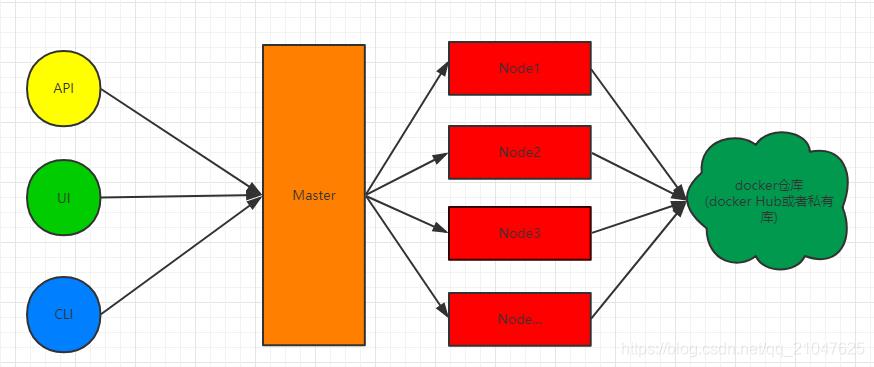
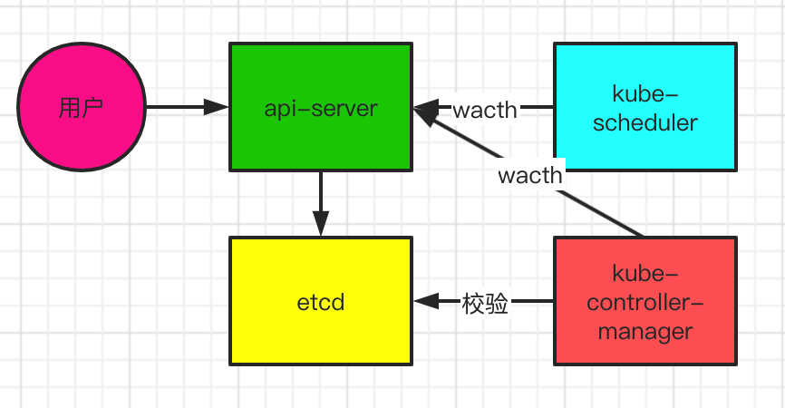

# Master和Node
Kubernetes中的大部分概念如`Node、Pod、Replication Controller、Service`等都可以看作一种“资源对象”，几乎所有的资源对象都可以通过Kubernetes提供的kubectl工具（或者API编程调用）执行增、删、改、查等操作并将其保存在`etcd(是一个强一致的分布式存储)`中持久化存储

Kuberneters中主机(可以是物理机或者虚拟机)主要分为两种`Master`和`Node`

在介绍Master和Node之前先了解一下Kubernetes主体架构：  

用户可以通过 API接口、UI界面和命令行来访问k8S的Master，之后Master依据接収的请求对Node上面的容器做新增，更新或者删除的操作；容器的镜像又依赖于镜像仓库，需要从镜像仓库拉取所需的镜像，同时还需要将自定义的镜像保存到镜像仓库供容器来使用

## Master
Kubernetes里的 Master 负责管理 Node, 控制 Node 具体运行什么容器, 同时还承担外部数据访问的角色

如果部署着Master的机器宕机或者不可用，那么对集群内容器应用的管理都将失效

Master的关键组件：
- `Kubernetes API Server (kube-apiserver)`：提供了 HTTP Rest 接口的关键服务进程，是Kubernetes里所有资源的增、删、改、查等操作的唯一入口，也是集群控制的入口进程
- `Kubernetes Controller Manager (kube-controller-manager)`：Kubernetes里所有资源对象的自动化控制中心
- `Kubernetes Scheduler (kube-scheduler)`：负责资源调度（Pod调度）的进程
- `etcd`：用户保存应用程序配置信息的守护进程，是一个k-v存储系统，存储内容为用用户发出的API请求中容器的具体要求，是一个强一致性的

各个组件关系如下：  

用户发起一个对容器的操作请求，kube-apiserver 接受到之后会首先对用户发送的指令进行验证，没有问题后会把指令存储到 etcd。kube-scheduler 和 kube-controller-manager 分别监听 kube-apiserver 请求，验证成功后如果是新建容器，kube-scheduler 会寻找最合适的Node用于运行容器，而 kube-controller-manager 通过监听获得指令之后会去完成指令的要求。完成后会以轮询的方式校验资源(主要是容器)的状态和存储在 etcd 里面的指令要求的是否一致，不一致的话进行重新部署资源(重启或者重新运行镜像)

## 补充：Event
Event是一个事件的记录，记录了事件的最早产生时间、最后重现时间、重复次数、发起者、类型，以及导致此事件的原因等众多信息。Event通常会关联到某个具体的资源对象上，是排查故障的重要参考信息。`kubectl describe pod`命令返回结果里包含了 event 信息。