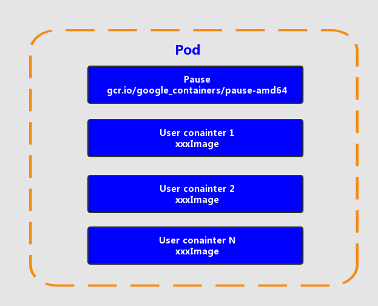
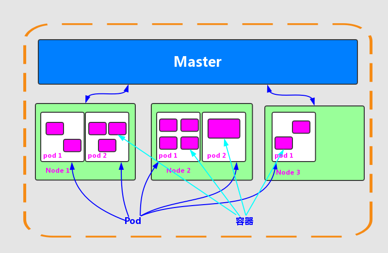
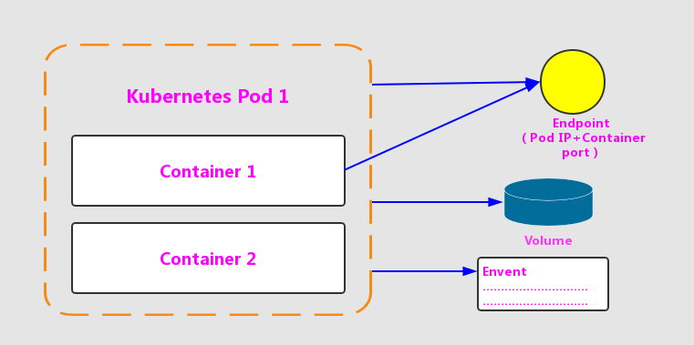

# Pod
Pod 是 Kubernetes 的最重要也最基本的概念，如图所示是 Pod 的组成示意图，我们看到每个 Pod 都有一个特殊的被成为“根容器”的 Pause 容器。Pause 容器对应的镜像属于 Kubernetes 平台的一部分，除了 `Pause` 容器，每个 Pod 还包含一个或多个紧密相关的用户业务容器。  


## 为什么Kubernetes会设计出一个全新的Pod概念并且Pod有这样特殊的组成结构？
1. 在一组容器作为一个单元的情况下，我们难以对“整体”简单地进行判断及有效地进行行动。比如，一个容器死亡了，此时算是整体死亡么？引入业务无关并且不易死亡的Pause容器作为Pod的根容器，以它的状态代表整体容器组的状态，就简单、巧妙地解决了这个难题
2. Pod 里的多个业务容器共享 Pause 容器的 IP，共享 Pause 容器挂接的 Volume，这样既简化了密切关联的业务容器之间的通信问题，也很好地解决了它们之间的文件共享问题

## Pod网络
Kubernetes 为每个 Pod 都分配了唯一的 IP 地址，称之为 Pod IP，一个 Pod 里的多个容器共享 Pod IP 地址。Kubernetes 要求底层网络支持集群内任意两个 Pod 之间的 TCP/IP 直接通信，这通常采用虚拟而层网络技术来实现。只需要牢记一点：在 Kubernetes 里，一个 Pod 里的容器与另外主机上的 Pod 容器能够直接通信

## Pod存储
Pod 能够指定一个共享存储卷的集合，在Pod中所有的容器都能够访问共享存储卷，允许这些容器共享数据。存储卷也允许 Pod 持久化数据，以防止其中的容器需要被重启

## Pod类型
- 普通的Pod：一旦被创建，就会被放入到 etcd 中存储，随后会被 Kubernetes Master 调度到某个具体的 Node 上并进行绑定（Binding），随后该 Pod 被对应的 Node上 的 kubelet 进程实例化成一组相关的 Docker 容器并且启动起来
- 静态Pod（Static Pod）：它并不存放在 Kubernetes 的 etcd 存储里，而是存放在某个具体的 Node上 的一个具体文件中，并且只在此 Node 上启动运行

在默认情况下，当 Pod 里的某个容器停止时，Kubernetes 会自动检测到这个问题并且重新启动这个 Pod（重启 Pod 里的所有容器），如果 Pod 所在的 Node 宕机，则会将这个 Node 上的所有 Pod 重新调度到其他节点上。Pod、容器与 Node 的关系图如图所示：  


## 计算资源设置限额
每个 Pod 都可以对其能使用的服务器上的计算资源设置限额，当前可以设置限额的计算资源有 CPU 与 Memory 两种，其中 CPU 的资源单位为 CPU （Core）的数量，是一个绝对值而非相对值  
在 Kubernetes 里，通常以千分之一的CPU配额为最小单位，用m来表示。通常一个容器的CPU配额被定义为100～300m，即占用0.1~0.3个CPU。由于CPU配额是一个绝对值，所以无论在拥有几个Core的机器上，100m这个配额所代表的CPU的使用量都是一样的。与CPU配额类似，Memory配额也是一个绝对值，它的单位是内存字节数。

计算资源进行配额限定需要设定以下两个参数：
- `Request`：该资源的最小申请量，系统必须满足要求
- `Limits`：该资源最大允许使用量，不能被突破，当容器试图使用超过这个量的资源时，可能会被Kubernetes Kill并重启

举个栗子：
```yaml
spec:
   containers:
   - name: db
     image: mysql
     resources:
       request:
        memory: "64Mi"
        cpu: "250m"
       limits:
        memory: "128Mi"
        cpu: "500m"
```

Pod及Pod周边对象的示意图：  


## Pod定义模板
```yaml
apiVersion: v1        　　          #必选，版本号，例如v1,版本号必须可以用 kubectl api-versions 查询到 .
kind: Pod       　　　　　　         #必选，Pod
metadata:       　　　　　　         #必选，元数据
  name: string        　　          #必选，Pod名称
  namespace: string     　　        #必选，Pod所属的命名空间,默认为"default"
  labels:       　　　　　　          #自定义标签
    - name: string      　          #自定义标签名字
  annotations:        　　                 #自定义注释列表
    - name: string
spec:         　　　　　　　            #必选，Pod中容器的详细定义
  containers:       　　　　            #必选，Pod中容器列表
  - name: string      　　                #必选，容器名称,需符合RFC 1035规范
    image: string     　　                #必选，容器的镜像名称
    imagePullPolicy: [ Always|Never|IfNotPresent ]  #获取镜像的策略 Alawys表示下载镜像 IfnotPresent表示优先使用本地镜像,否则下载镜像，Nerver表示仅使用本地镜像
    command: [string]     　　        #容器的启动命令列表，如不指定，使用打包时使用的启动命令
    args: [string]      　　             #容器的启动命令参数列表
    workingDir: string                     #容器的工作目录
    volumeMounts:     　　　　        #挂载到容器内部的存储卷配置
    - name: string      　　　        #引用pod定义的共享存储卷的名称，需用volumes[]部分定义的的卷名
      mountPath: string                 #存储卷在容器内mount的绝对路径，应少于512字符
      readOnly: boolean                 #是否为只读模式
    ports:        　　　　　　        #需要暴露的端口库号列表
    - name: string      　　　        #端口的名称
      containerPort: int                #容器需要监听的端口号
      hostPort: int     　　             #容器所在主机需要监听的端口号，默认与Container相同
      protocol: string                  #端口协议，支持TCP和UDP，默认TCP
    env:        　　　　　　            #容器运行前需设置的环境变量列表
    - name: string      　　            #环境变量名称
      value: string     　　            #环境变量的值
    resources:        　　                #资源限制和请求的设置
      limits:       　　　　            #资源限制的设置
        cpu: string     　　            #Cpu的限制，单位为core数，将用于docker run --cpu-shares参数
        memory: string                  #内存限制，单位可以为Mib/Gib，将用于docker run --memory参数
      requests:       　　                #资源请求的设置
        cpu: string     　　            #Cpu请求，容器启动的初始可用数量
        memory: string                    #内存请求,容器启动的初始可用数量
    livenessProbe:      　　            #对Pod内各容器健康检查的设置，当探测无响应几次后将自动重启该容器，检查方法有exec、httpGet和tcpSocket，对一个容器只需设置其中一种方法即可
      exec:       　　　　　　        #对Pod容器内检查方式设置为exec方式
        command: [string]               #exec方式需要制定的命令或脚本
      httpGet:        　　　　        #对Pod内个容器健康检查方法设置为HttpGet，需要制定Path、port
        path: string
        port: number
        host: string
        scheme: string
        HttpHeaders:
        - name: string
          value: string
      tcpSocket:      　　　　　　#对Pod内个容器健康检查方式设置为tcpSocket方式
         port: number
       initialDelaySeconds: 0       #容器启动完成后首次探测的时间，单位为秒
       timeoutSeconds: 0    　　    #对容器健康检查探测等待响应的超时时间，单位秒，默认1秒
       periodSeconds: 0     　　    #对容器监控检查的定期探测时间设置，单位秒，默认10秒一次
       successThreshold: 0
       failureThreshold: 0
       securityContext:
         privileged: false
    restartPolicy: [Always | Never | OnFailure] #Pod的重启策略，Always表示一旦不管以何种方式终止运行，kubelet都将重启，OnFailure表示只有Pod以非0退出码退出才重启，Nerver表示不再重启该Pod
    nodeSelector: obeject   　　    #设置NodeSelector表示将该Pod调度到包含这个label的node上，以key：value的格式指定
    imagePullSecrets:     　　　　#Pull镜像时使用的secret名称，以key：secretkey格式指定
    - name: string
    hostNetwork: false      　　    #是否使用主机网络模式，默认为false，如果设置为true，表示使用宿主机网络
    volumes:        　　　　　　    #在该pod上定义共享存储卷列表
    - name: string     　　 　　    #共享存储卷名称 （volumes类型有很多种）
      emptyDir: {}      　　　　    #类型为emtyDir的存储卷，与Pod同生命周期的一个临时目录。为空值
      hostPath: string      　　    #类型为hostPath的存储卷，表示挂载Pod所在宿主机的目录
        path: string      　　        #Pod所在宿主机的目录，将被用于同期中mount的目录
      secret:       　　　　　　    #类型为secret的存储卷，挂载集群与定义的secre对象到容器内部
        scretname: string  
        items:     
        - key: string
          path: string
      configMap:      　　　　            #类型为configMap的存储卷，挂载预定义的configMap对象到容器内部
        name: string
        items:
        - key: string
          path: string
```