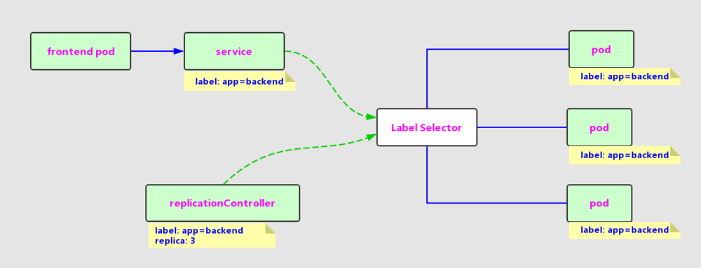
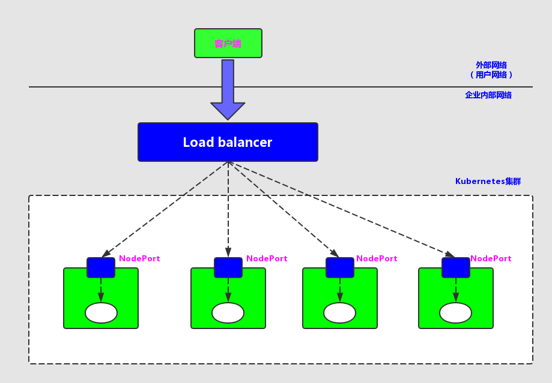

# Service

## 概述
Service 也是 Kubernetes 里的最核心的资源对象之一，Kubernetes 里的每个 Service 其实就是我们经常提起的微服务架构中的一个“微服务”。  


Kubernetes 的 Service 定义了一个服务的访问入口地址，前端的应用（Pod）通过这个入口地址访问其背后的一组由Pod副本组成的集群实例，Service 与其后端Pod副本集群之间则是通过 Label Selector 来实现“无缝对接”的。而RC的作用实际上是保证 Service 的服务能力和服务质量始终处于预期的标准。

### 访问调用
每个Pod都会被分配一个单独的IP地址，而且每个Pod都提供了一个独立的 Endpoint(Pod IP+ContainerPort)以被客户端访问，现在多个Pod副本组成了一个集群来提供服务，那么客户端如何来访问它们呢？  
Kubernetes 的解决方案是：运行在每个Node上的 kube-proxy 进程其实就是一个智能的软件负载均衡器，它负责把对 Service 的请求转发到后端的某个Pod实例上，并在内部实现服务的负载均衡与会话机制。但 Kubernetes 发明了一种很巧妙又影响深远的设计：Service 不是共用一个负载均衡的IP地址，而是每个 Service 分配了全局唯一的虚拟IP地址，这个虚拟IP地址被称为 `Cluster IP`。这样一来，每个服务就变成了具备唯一IP地址的“通信节点”，服务调用就变成了最基础的TCP网络通信问题。

Pod的 Endpoint 地址会随着Pod的销毁和重新创建而发生改变，因为新Pod的IP地址与之前旧Pod的不同。而 Service 一旦被创建，Kubernetes 就会自动为它分配一个可用的 Cluster IP，而且在 Service 的整个生命周期内。它的 Cluster IP 不会发生改变。于是，服务发现这个棘手的问题在 Kubernetes 的架构里也得到轻松解决：只要用Service的 Name 与Service的 Cluster IP 地址做一个DNS域名映射即可完美解决问题。

### 示例
创建一个名为tomcat-service.yaml的定义文件，内容如下：
```yaml
apiVersion: v1
kind: Service
metadata:
  name: tomcat-service
spec:
  ports:
  - port: 8080
  selector:
    tier: frontend
```
上述内容定义了一个名为“tomcat-service”的Service，它的服务端口为8080，拥有“tier-frontend”这个Label的所有Pod实例都属于它

**常用命令**  
```shell script
# 查看Endpoint列表
kubectl get endpoints

# 查看更多关于service的信息
kubectl get svc SERVICE-NAME -o yaml
```

## Kubernetes的服务发现机制
1. 首先，每个 Kubernetes 中的 Service 都有一个唯一的 Cluster IP 及唯一的名字，而名字是由开发者自己定义的，部署时也没有改变，所以完全可以固定在配置中。接下来的问题就是如何通过 Service 的名字找到对应的 Cluster IP；
2. Kubernetes 通过 Add-On 增值包的方式引入了DNS系统，把服务名作为dns域名，这样一来，程序就可以直接使用服务名来建立通信连接了。

## 外部系统访问Service的问题
Kubernetes里的“三种IP”
- Node IP：Node节点的IP地址，是Kubernetes集群中每个节点的物理网卡的IP地址，这是一个真实存在的物理网络，所有属于这个网络的服务器之间都能通过这个网络直接通信
- Pod IP：Pod的IP地址，它是Docker Engine根据docker0网桥的IP地址段进行分配的，通常是一个虚拟的二层网络，前面我们说过，Kubernetes 里一个Pod里的容器访问另外一个Pod里的容器，就是通过 Pod IP 所在的虚拟二层网络进行通信的，而真实的TCP/IP流量则是通过Node IP所在的物理网卡流出的
- Cluster IP：Service的IP地址，它也是一个虚拟的IP，但更像是一个“伪造”的IP网络，原因有以下几点：
    - Cluster IP 仅仅作用于 Kubernetes Service 这个对象，并由 Kubernetes 管理和分配IP地址（来源于Cluster IP地址池）。
    - Cluster IP 无法被Ping，因为没有一个“实体网络对象”来响应。
    - Cluster IP 只能结合 Service Port 组成一个具体的通信端口，单独的 Cluster IP 不具备TCP/IP通信的基础，并且它们属于 Kubernetes 集群这样一个封闭的空间，集群之外的节点如果要访问这个通信端口，则需要做一些额外的工作。
    - 在 Kubernetes 集群之内，Node IP网、Pod IP网与Clsuter IP之间的通信，采用的是 Kubernetes 自己设计的一种编程方式的特殊的路由规则。

**总得来说就是Service的Cluster IP属于Kubernetes集群内部的地址，无法在集群外部直接使用这个地址。**

### 将服务对外暴露
```yaml
apiVersion: v1
kind: Service
metadata:
  name: tomcat-service
spec:
  type: NodePort
  ports:
   - port: 8080
     nodePort: 31002
  selector:
    tier: frontend
```
nodePort:31002 这个属性表明我们手动指定了一个 tomcat-service 的对外暴露端口 NodePort 为 31002，否则Kubernetes会自动分配一个可用的端口

### 负载均衡
  
图中的Load balancer组件独立于Kubernetes集群之外，通常是一个硬件的负载均衡器，或者是以软件方式实现的，例如Nginx。对于每个Service，我们通常需要配置一个对应的Load balancer实例来转发流量到后端的Node上。
